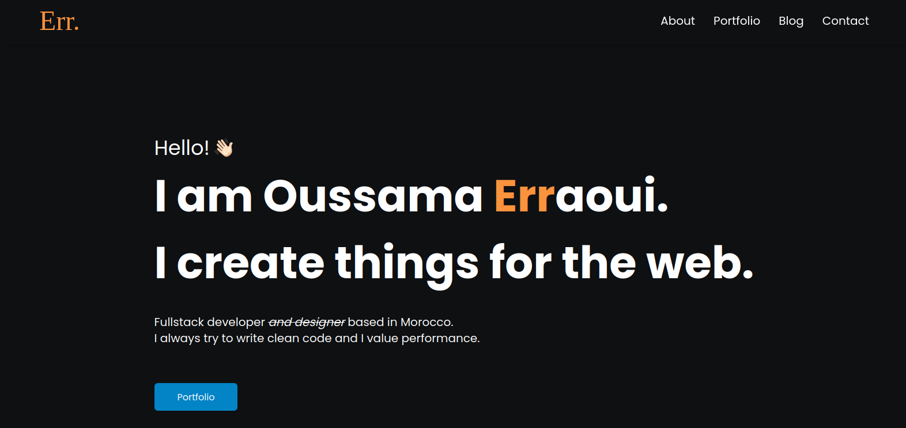

# Portfolio Website - v1.0
# [oussamaerr.vercel.app](https://oussamaerr.vercel.app)

## TL;DR

You can fork this repo to modify and make changes of your own. Please give me proper credit by linking back to this github repo. Thanks!

## Built With

My personal portfolio [oussamaerr.vercel.app](https://oussamaerr.vercel.app), which features some of my GitHub projects as well as my resume and technical skills.

This project was built using these technologies:

- Next.js
- Tailwind
- Vercel

## Features

- 📖 Single Page Application
- 🎨 Styled with tailwind
- 📱 Fully Responsive

## Getting Started

Clone down this repository. You will need Node.js and Git installed globally on your machine.

## Installation and Setup Instructions

- Installation: `npm install`
- In the project directory, you can run: `npm run dev`

Runs the app in the development mode.
Open [http://localhost:3000](http://localhost:3000) to view it in the browser. The page will reload if you make edits.

## Usage Instructions

Open the project folder and navigate to `/app/components/`.
You will find all the components used, and you can edit your information accordingly.

## Show Your Support

Give a ⭐ if you like this website!